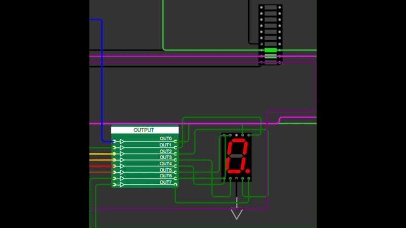

   

# Tiny Tapeout 7-Segment Display Writer

- [Read the documentation for project](docs/info.md)

Based on [teHELLo-3orLd Runnerxt](https://github.com/r4d10n/tinytapeout-HELLo-3orLd-7seg), this project was an attept at displaying my Username on the 7 segment display. The [Wokwi Project](https://wokwi.com/projects/458140717611045889) can be found here.

The whole project is built on Tiny Tapeout.
To learn more and get started, visit https://tinytapeout.com.

For the logic design, check out the excel sheet that I screenshotted below. Its concept is taken from the Hello 3orLd project but modified to my needs. I used a binary counter to count from 0 to 6, and then used a combinational logic block to map each value of the counter to a specific letter on the 7-segment display.

---

---

The Logic design is implemented in Wowki manually and the final design is shown below.

---

Below is the final design in Wokwi, and the gif shows the design in action. The clock is set to 1 Hz, so you can see the letters changing every second as the counter increments from 0 to 6.

~OzelHD

